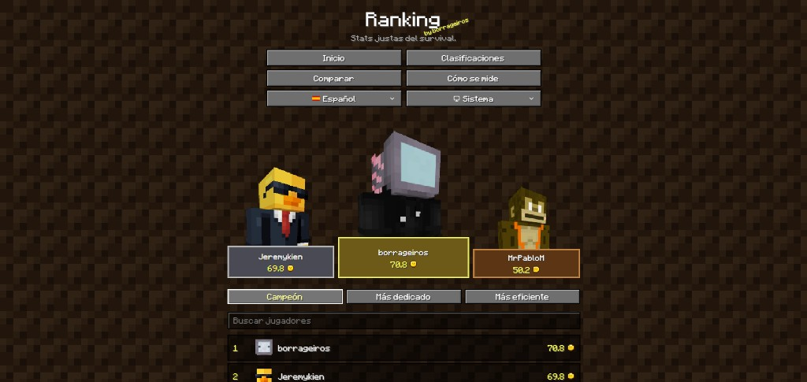

# ⛏️ mc-stats-webui

**Live competitive rankings for your Minecraft survival server.**

A **Fabric server mod** that embeds a small web UI + API on a specific port. Players open it in a browser — no client mod needed.



## ✨ What you get

- 🏆 Live leaderboards and champion score
- 🆚 Player compare
- 📊 Vanilla stats catalog
- 🌐 UI + API on the same port

| URL | What |
| --- | --- |
| `http://localhost:25580/` | Web UI |
| `http://localhost:25580/api/players` | JSON API |

## 🏗️ How it works

1. The mod starts with the world and opens an embedded HTTP server.
2. It reads vanilla player stats on the server thread.
3. The SvelteKit UI is built static and shipped **inside the JAR**.

More detail: [endpoints](docs/endpoints.md) · [stats & champion](docs/stats-analysis.md)

## 🛠️ Development

**Needs:** Java 25 · Node 24+ · [Yarn via Corepack](https://yarnpkg.com/corepack) · Fabric 26.2

```bash
cd web
corepack yarn install
corepack yarn dev
```

UI: `http://localhost:5173` (proxies `/api` → `25580`)

Build the mod (and the web UI):

```bash
./gradlew build
```